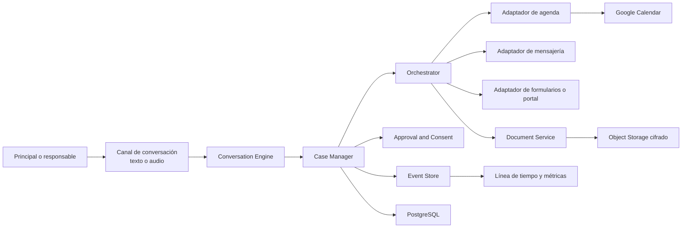

# SDD — Agente representante para trámites

**Estado:** propuesta inicial basada en el código vigente  
**Fecha:** 2026-07-24  
**Producto mínimo viable:** agente conversacional que representa a una persona para solicitar, coordinar y documentar un trámite médico-administrativo.

La ejecución distribuida de este SDD se gestiona en
`specs/001-medical-appointment/`: especificación, plan, tareas y gates de
validación. Todos los agentes deben respetar `AGENTS.md` y
`.specify/memory/constitution.md`.

## 1. Decisión de producto

Talkative puede ser la base del producto, pero no es todavía el producto.

La infraestructura actual sirve para registrar agentes, ejecutar herramientas, pedir aprobación humana, emitir eventos, medir ejecuciones y delegar subtareas. El MVP debe conservar esas piezas y agregar una capa de producto centrada en:

1. una persona representada;
2. una conversación persistente;
3. un caso con un resultado verificable;
4. una contraparte externa;
5. consentimiento y confirmaciones explícitas;
6. documentos y eventos de calendario como artefactos del caso.

El primer objetivo no es crear un agente médico ni tomar decisiones clínicas. Es resolver un trámite administrativo de punta a punta y dejar evidencia comprensible de qué se pidió, qué se confirmó y qué se obtuvo.

## 2. Lectura verificada de la arquitectura actual

### 2.1 Capacidades reutilizables

| Capacidad actual | Evidencia en el código | Uso en el MVP |
|---|---|---|
| Registro y ciclo de vida de agentes | `AgentHub`, `AgentRunner` | ejecutar un agente principal y adaptadores especializados |
| Separación por tenant | guardas, registros y eventos con `tenant_id` | aislar organizaciones y datos |
| Event store | eventos de agente y orquestador | construir la línea de tiempo auditable del caso |
| Aprobación humana | `approval/store.ts` y rutas | confirmar envío, pago, cancelación o datos sensibles |
| Tool runner restringido | `agents/toolRunner.ts` | ejecutar adaptadores deterministas |
| Planner y supervisor | `master-orchestrator/*` | descomponer un objetivo en pasos acotados |
| Prompt registry y contexto acotado | `prompt/*` | versionar comportamiento y limitar contexto |
| Métricas Prometheus | `observability/metrics.ts` | instrumentación técnica de base |
| PostgreSQL opcional | Prisma + `PERSISTENCE_DRIVER` | persistencia de producción |

### 2.2 Lo que existe sólo como demostración

- `interpretConversation()` no comprende intención ni contexto: divide texto por comas, puntos y conectores para crear nodos.
- `AgentRunner.handleMessage()` genera una respuesta técnica predefinida y activa scripts por palabras clave.
- El contexto conversacional son los últimos ocho eventos; no hay una entidad conversación ni memoria estructurada del caso.
- El planner crea un plan con LLM, pero el plan no se persiste. La ejecución recibe otra vez el plan completo desde el cliente.
- El supervisor es secuencial, aborta al primer fallo y no implementa una política real de reintento, derivación o compensación.
- Los eventos de plataforma miden ejecuciones y herramientas, no el resultado que la persona quería obtener.
- `MissionControl` es una consola de operador, no una experiencia de conversación para la persona representada.

### 2.3 Capacidades ausentes

- perfil de la persona representada y relación representante/dependiente;
- consentimiento, alcance y vencimiento de la delegación;
- conversación persistente por turnos;
- expediente o `Case`;
- estado verificable de un trámite;
- campos requeridos, datos confirmados y datos todavía dudosos;
- archivos, comprobantes y clasificación documental;
- conectores de mensajería, turnos, pagos o portales;
- entrada/salida de audio;
- Google Calendar;
- políticas específicas para datos de salud y menores;
- seguimiento de intentos, derivaciones y resultado de negocio.

## 3. Vocabulario de dominio

- **Principal:** persona que autoriza al agente y es dueña del caso.
- **Subject:** persona a quien corresponde el trámite. Puede ser el principal o un dependiente, por ejemplo un hijo.
- **Counterparty:** clínica, consultorio, profesional, aseguradora u organismo con el que se interactúa.
- **Conversation:** intercambio por texto o audio entre una persona y el agente, o entre el agente y una contraparte.
- **Case:** objetivo administrativo persistente, por ejemplo “obtener turno con pediatra”.
- **Task:** paso verificable dentro del caso.
- **Attempt:** intento concreto de ejecutar una tarea por un canal.
- **Handoff:** derivación a una persona u otro canal cuando el agente no puede continuar.
- **Artifact:** evidencia obtenida o generada: turno, comprobante, certificado, receta, informe o transcripción.
- **Consent:** autorización explícita, acotada por acción, datos, contraparte y vigencia.

El agente debe identificarse siempre de forma transparente:

> “Hola, soy un asistente digital autorizado por Ana Pérez para coordinar este trámite. Puedo confirmar los datos necesarios y dejarle a Ana la aprobación de cualquier pago o decisión sensible.”

Nunca debe simular ser el principal.

## 4. Arquitectura objetivo



### 4.1 Agente principal y adaptadores

Para el MVP conviene un agente principal visible, no varios personajes hablando con el usuario.

El agente principal:

- comprende el objetivo;
- pide sólo los datos faltantes;
- resume lo entendido;
- solicita consentimiento o aprobación cuando corresponde;
- muestra progreso y resultado;
- deriva trabajo a adaptadores internos sin exponer la complejidad.

Los adaptadores son componentes deterministas, no “personalidades”:

- `calendar`: disponibilidad, creación, cambio y cancelación;
- `messaging`: envío y recepción por el canal habilitado;
- `forms`: lectura y completado de formularios conocidos;
- `documents`: almacenamiento, extracción, clasificación y entrega;
- `payments`: en una fase posterior y siempre con aprobación.

### 4.2 Regla de arquitectura

El LLM propone y conversa. Los servicios de dominio validan. Los adaptadores ejecutan. El event store prueba qué pasó.

Ninguna frase generada por el modelo debe convertir por sí sola un caso en exitoso. El éxito requiere una señal verificable de un adaptador o una confirmación explícita de la contraparte.

## 5. Modelo mínimo de datos

### 5.1 Entidades nuevas

```text
Principal
  id, tenant_id, display_name, locale, timezone

Subject
  id, principal_id, relationship, display_name, birth_date

Delegation
  id, principal_id, subject_id, scope[], status, valid_from, valid_until

Conversation
  id, principal_id, case_id?, channel, status, started_at, last_turn_at

ConversationTurn
  id, conversation_id, actor, modality, text, transcript_confidence?,
  created_at, correlation_id

Case
  id, principal_id, subject_id, type, goal, status, priority,
  counterparty_id?, due_at?, created_at, completed_at?

CaseField
  case_id, key, value_encrypted, source, confidence, confirmed_at?

Task
  id, case_id, type, status, required_inputs[], output_contract,
  attempt_limit, assigned_adapter

Attempt
  id, task_id, sequence, channel, status, started_at, ended_at,
  failure_code?, retryable, external_reference?

Consent
  id, case_id, scope, data_categories[], counterparty_id?,
  granted_at, expires_at?, revoked_at?

Artifact
  id, case_id, type, storage_key, mime_type, checksum,
  source, verification_status, created_at

CalendarProjection
  id, case_id, provider, external_event_id, starts_at, ends_at,
  sync_status, last_synced_at
```

### 5.2 Estados del caso

```text
draft
  -> collecting_information
  -> ready_for_confirmation
  -> executing
  -> waiting_external
  -> completed

Desde cualquier estado operativo:
  -> needs_user
  -> needs_human
  -> blocked
  -> cancelled
  -> expired
```

`completed` sólo es válido si el contrato de salida del tipo de caso se cumple.

Ejemplo para `medical_appointment`:

```json
{
  "required": [
    "provider_name",
    "specialty",
    "starts_at",
    "location_or_join_url",
    "confirmation_reference"
  ]
}
```

## 6. Contrato de interacción y eventos medibles

Cada acción significativa debe producir un evento de dominio con este sobre:

```json
{
  "event_id": "evt_...",
  "event_type": "attempt.failed",
  "occurred_at": "2026-07-24T15:00:00Z",
  "tenant_id": "tenant_...",
  "principal_id": "principal_...",
  "subject_id": "subject_...",
  "conversation_id": "conversation_...",
  "case_id": "case_...",
  "task_id": "task_...",
  "attempt_id": "attempt_...",
  "channel": "text",
  "actor": "agent",
  "correlation_id": "corr_...",
  "payload": {
    "failure_code": "NO_AVAILABILITY",
    "retryable": true
  }
}
```

Eventos mínimos:

- `conversation.started`
- `turn.received`
- `turn.responded`
- `intent.proposed`
- `field.requested`
- `field.captured`
- `field.confirmed`
- `consent.requested`
- `consent.granted`
- `case.created`
- `task.started`
- `attempt.started`
- `attempt.succeeded`
- `attempt.failed`
- `retry.scheduled`
- `handoff.requested`
- `handoff.completed`
- `artifact.received`
- `artifact.verified`
- `calendar.sync_succeeded`
- `calendar.sync_failed`
- `case.completed`
- `case.cancelled`

No registrar texto clínico o documentos completos dentro del payload analítico. Los eventos guardan identificadores, categorías y resultados; el contenido sensible vive cifrado en el expediente.

## 7. Métricas de producto

### 7.1 Métrica principal

**Verified Task Completion Rate**

```text
casos completados con evidencia verificable
------------------------------------------------
casos iniciados que alcanzaron estado ejecutable
```

No contar como éxito una intención detectada, una respuesta del LLM ni un mensaje enviado.

### 7.2 Embudo

1. `request_understood_rate`: intención confirmada / conversaciones iniciadas.
2. `information_completion_rate`: casos con datos mínimos / casos creados.
3. `consent_completion_rate`: consentimientos otorgados / consentimientos solicitados.
4. `execution_start_rate`: casos ejecutados / casos listos para confirmar.
5. `verified_completion_rate`: casos completados / casos ejecutados.
6. `artifact_delivery_rate`: artefactos entregados / casos que requieren artefacto.

### 7.3 Calidad operativa

- `attempts_per_completed_case`;
- `first_attempt_success_rate`;
- `median_time_to_completion`;
- `external_wait_time`;
- `handoff_rate` y motivo;
- `user_reprompt_rate`;
- `field_correction_rate`;
- `calendar_sync_success_rate`;
- `artifact_verification_failure_rate`;
- `abandonment_rate` por estado;
- costo por caso completado, no sólo costo por llamada al modelo.

### 7.4 Naturalidad y confianza

Medir sin confundir “conversación agradable” con resultado:

- cantidad de turnos hasta confirmar el objetivo;
- preguntas repetidas por dato ya conocido;
- porcentaje de resúmenes aceptados sin corrección;
- intervenciones donde el agente explicó que era un agente;
- aprobación explícita antes de acciones sensibles;
- encuesta breve posterior: “¿Quedó resuelto?” y “¿Tuviste que repetir información?”.

## 8. Flujo MVP 1 — Obtener un turno médico

### 8.1 Conversación con el principal

**Usuario:** “Necesito un turno con un pediatra para Tomás la semana que viene, preferentemente por la tarde.”

**Agente:** “Entendí: querés un turno de pediatría para Tomás la semana que viene, después de las 14. ¿Busco primero con la cartilla que ya tenés registrada? Antes de contactar al consultorio te voy a mostrar los datos que compartiría.”

El agente:

1. crea un caso `medical_appointment`;
2. vincula al subject Tomás y verifica la relación de responsabilidad;
3. recupera datos ya confirmados y pregunta sólo lo faltante;
4. muestra especialidad, rango horario, cobertura y datos a compartir;
5. obtiene consentimiento;
6. consulta o contacta a la contraparte;
7. registra cada intento;
8. presenta opciones si hay más de una;
9. obtiene confirmación del principal;
10. agenda el turno y entrega comprobante.

### 8.2 Conversación con la contraparte

**Agente:** “Buen día. Soy un asistente digital autorizado por la responsable de Tomás para coordinar un turno de pediatría. ¿Tienen disponibilidad la semana próxima después de las 14?”

Si se solicita un dato no autorizado:

**Agente:** “No tengo autorización para compartir ese dato todavía. Puedo consultarlo con la responsable y retomar la conversación.”

### 8.3 Resultado verificable

- referencia del turno;
- profesional y especialidad;
- fecha, hora y ubicación;
- costo/copago si fue informado;
- comprobante o mensaje de confirmación;
- evento visible en Google Calendar;
- línea de tiempo de intentos.

## 9. Flujo MVP 2 — Solicitar un certificado o informe

**Usuario:** “Necesito el certificado de aptitud que le hicieron a Tomás para presentarlo en la escuela.”

El agente debe distinguir:

1. si el documento ya existe y sólo hay que localizarlo;
2. si debe pedirse una copia al centro médico;
3. si hace falta un nuevo turno o evaluación;
4. quién puede recibirlo y por qué canal;
5. cuál es la fecha límite.

Posible plan:

```text
Confirmar documento y finalidad
  -> confirmar centro y fecha aproximada
  -> pedir autorización para compartir identidad
  -> buscar documento existente
  -> si no existe, contactar al centro
  -> esperar respuesta
  -> verificar nombre, fecha y tipo de documento
  -> entregar al principal
  -> registrar artefacto y vencimiento
```

El caso termina sólo cuando el documento correcto fue recibido y verificado, o cuando queda explícitamente derivado con el motivo y el próximo responsable.

## 10. Google Calendar

Calendar es una proyección del caso, no la fuente de verdad.

Reglas:

- crear el evento sólo después de una confirmación verificable;
- guardar `external_event_id` para idempotencia;
- no duplicar eventos al reintentar;
- actualizar o cancelar el evento cuando cambia el turno;
- incluir sólo el mínimo de información sensible;
- agregar enlace al caso dentro de Talkative, no historia clínica en la descripción;
- registrar `calendar.sync_succeeded` o `calendar.sync_failed`.

El MVP puede comenzar con OAuth individual del principal. Una integración organizacional o delegación de dominio queda fuera de la primera fase.

## 11. Seguridad y límites

Por tratar datos personales, de salud y potencialmente de menores:

- cifrado en tránsito y reposo;
- separación entre metadatos analíticos y contenido sensible;
- control de acceso por principal, subject, tenant y rol;
- consentimiento revocable y con alcance;
- auditoría de lectura, escritura, descarga y envío;
- retención configurable y eliminación verificable;
- URLs de archivos con vencimiento;
- secretos de conectores fuera de prompts y logs;
- aprobación humana para pagos, cancelaciones, aceptación de condiciones y divulgación sensible;
- respuesta de emergencia fuera de alcance: el agente debe derivar a canales humanos apropiados, no diagnosticar.

Antes de una prueba con datos reales se necesita revisión legal y de privacidad de la jurisdicción aplicable. El MVP técnico debe usar datos sintéticos hasta completar esa revisión.

## 12. Plan de implementación

### Fase 0 — Alinear la base

- [x] auditar el runner, orquestador, canales, eventos, métricas y persistencia;
- [x] identificar capacidades reutilizables y brechas;
- [ ] separar en la navegación y documentación el POC de agentes del producto de seguridad barrial;
- [ ] elegir PostgreSQL como modo obligatorio para el MVP;
- [ ] definir política de datos sensibles y entorno de prueba sintético.

**Criterio de salida:** una sola dirección de producto activa y un entorno reproducible.

### Fase 1 — Núcleo conversacional y expediente

- [ ] agregar modelos `Principal`, `Subject`, `Delegation`, `Conversation`, `ConversationTurn`, `Case`, `CaseField`, `Task`, `Attempt`, `Consent` y `Artifact`;
- [ ] crear `CaseManager` con máquina de estados;
- [ ] sustituir el parser por palabras por un contrato de turno estructurado;
- [ ] persistir planes del orquestador;
- [ ] agregar idempotencia y correlación extremo a extremo;
- [ ] emitir eventos de dominio del apartado 6;
- [ ] construir una UI de conversación y línea de tiempo.

**Criterio de salida:** un caso simulado sobrevive reinicios y puede reconstruirse sólo desde base de datos y eventos.

### Fase 2 — Primer flujo vertical

- [ ] implementar `medical_appointment` con una contraparte simulada;
- [ ] capturar y confirmar datos faltantes;
- [ ] implementar consentimiento y aprobación;
- [ ] soportar intentos, espera externa y derivación;
- [ ] generar un comprobante sintético;
- [ ] proyectar el resultado en un calendario simulado.

**Criterio de salida:** diez escenarios E2E sintéticos, incluidos sin disponibilidad, dato faltante, corrección, reintento, rechazo y derivación.

### Fase 3 — Integraciones reales controladas

- [ ] Google Calendar con OAuth e idempotencia;
- [ ] un canal real de texto;
- [ ] almacenamiento cifrado de artefactos;
- [ ] una única contraparte piloto con API o procedimiento autorizado;
- [ ] dashboard de funnel, intentos, derivaciones y tiempos.

**Criterio de salida:** completar y auditar un trámite real no clínico con usuarios piloto autorizados.

### Fase 4 — Audio

- [ ] transcripción con confianza por segmento;
- [ ] confirmación textual de nombres, fechas, documentos y montos;
- [ ] síntesis de voz;
- [ ] interrupciones, silencios y cambio texto/audio;
- [ ] métricas separadas por modalidad.

**Criterio de salida:** el mismo contrato de caso funciona por texto y audio sin bifurcar la lógica de negocio.

## 13. Primer corte recomendado

Construir primero “pedir y confirmar un turno con una clínica simulada”:

- un agente principal;
- sólo texto;
- un principal y un dependiente;
- una especialidad;
- una contraparte simulada;
- sin pagos;
- aprobación antes de enviar;
- comprobante;
- calendario simulado;
- línea de tiempo y métricas completas.

Este corte prueba el valor central —pedir algo y obtener un resultado— sin mezclar desde el inicio voz, scraping de portales, pagos y múltiples proveedores.

## 14. Preguntas de producto que deben resolverse antes de una integración real

1. ¿El primer usuario es el paciente adulto, un responsable de un menor o ambos?
2. ¿La primera contraparte tendrá API, correo, mensajería o atención telefónica?
3. ¿El agente sólo coordina o también puede aceptar costos previamente acotados?
4. ¿Qué evidencia mínima convierte cada tipo de trámite en “completado”?
5. ¿Qué datos puede reutilizar entre casos y cuáles deben confirmarse siempre?
6. ¿Quién recibe una derivación y en cuánto tiempo debe responder?
7. ¿Qué jurisdicción y política de retención rigen el piloto?
